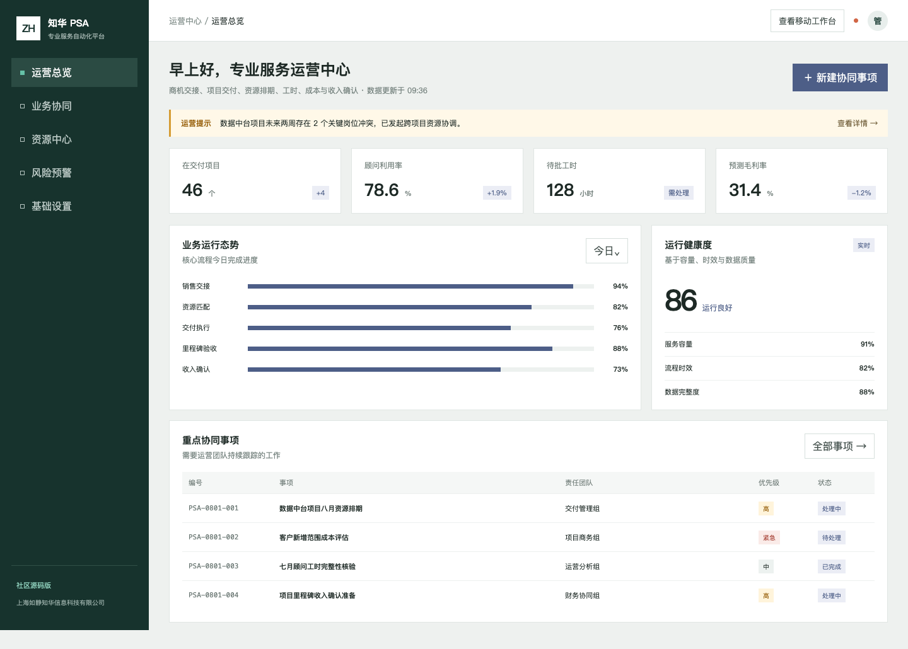
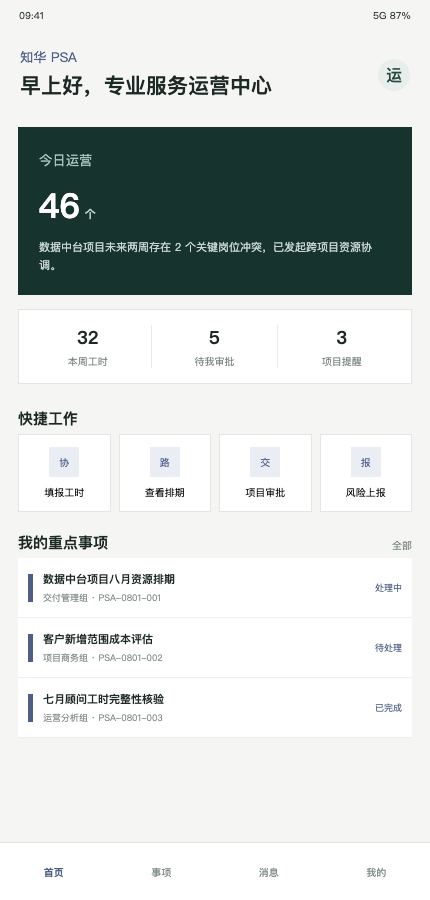

# ZhuaTech PSA

> 知华科技专业服务自动化平台社区源码版：把项目交接、资源排期、工时、成本、毛利和收入确认放进同一条交付主线。

[官网](https://www.zhuatech.cn/) ｜ [能力清单](#能力清单) ｜ [技术方案](#技术方案) ｜ [快速体验](#快速体验) ｜ [授权说明](#授权说明)

版权所有 © 2026 上海如静知华信息科技有限公司。本工程仅供个人非商业学习交流；商用、企业内部生产使用、SaaS 或有偿交付须取得书面授权。

## 一个可运行的专业服务交付样例

ZhuaTech PSA 面向咨询、软件实施、技术服务和项目制组织。管理端呈现项目组合、人员利用率、待批工时、预测毛利和跨团队事项；响应式 H5 为顾问提供工时填报、排期查看、项目审批与风险上报入口。后端增加项目毛利预测能力，可根据计划工时、实际投入、成本费率和完成度识别利润风险。

### 管理视角



管理者可在同一页观察销售交接、资源匹配、执行、验收和收入确认进度，并追踪关键资源冲突与范围变更。

### 顾问视角



移动端为项目成员保留高频动作和个人重点事项，适合继续扩展工时日历、费用申请、里程碑确认和客户签收。

## 能力清单

- 项目组合态势：在交付项目、利用率、工时审批、预测毛利。
- 交付协同：销售交接、人员排期、里程碑、收入确认及风险事项。
- 毛利预测：计算预计成本、预计毛利、毛利率和 `HEALTHY / WATCH / LOSS` 状态。
- 移动工作台：填报工时、查看排期、项目审批、风险上报。
- 基础安全：管理者与操作员权限隔离、参数校验、统一响应和自动化测试。

## 技术方案

```text
Vue 3 + Vite（管理端 / H5）
             ↓ HTTP JSON
Spring Boot 4 + Java 21 + Spring Security
             ↓ JPA
           MySQL 8
```

后端包名统一为 `cn.zhuatech.psa`。详细接口见 [API 文档](docs/API.md)，演进建议见 [架构说明](docs/ARCHITECTURE.md)。

## 快速体验

```bash
cp .env.example .env
docker compose up --build
```

访问 `http://localhost:8090`。演示账号为 `admin / admin123` 与 `operator / operator123`；它们只适合本地开发，任何联网部署必须替换并补充 SSO、RBAC、审计和数据保护。

不使用 Docker 时：

```bash
cd backend && mvn spring-boot:run
cd frontend && npm install && npm run dev
```

## 授权说明

本项目采用 **ZhuaTech Community Source License 1.0（个人非商业版）**。它含非商业限制，属于社区源码/source-available 项目，不是 OSI 认可的开源许可证。

个人可免费学习、研究、交流和非商业修改；企业生产、商业部署、SaaS、收费分发、实施咨询、培训、投标和品牌替换均不在免费许可范围。详情见 [LICENSE](LICENSE)。

## 联系知华科技

[知华科技官网（上海如静知华信息科技有限公司）](https://www.zhuatech.cn/) 提供商业授权、专业服务系统定制、私有化部署与系统集成。也可扫描下方任一微信二维码咨询。

<p align="center">&nbsp;&nbsp;&nbsp;&nbsp;</p>

本仓库不含真实客户、合同、人员或财务数据。请勿提交令牌、私钥和业务敏感信息；贡献与安全流程见 [CONTRIBUTING.md](CONTRIBUTING.md) 和 [SECURITY.md](SECURITY.md)。

关键词：知华科技 PSA、专业服务自动化、项目交付管理、资源排期系统、工时管理、项目毛利预测、Java PSA、Vue 管理系统、上海软件定制。

## 可计费产能预测

新增 `POST /api/psa/insights/billable-capacity-forecast`。系统综合顾问人数、可用工时、已签约需求和按 60% 折算的确认中商机，预测未来周期的可计费产能利用率，给出 `ADD_CAPACITY`、`REBALANCE` 或 `BALANCED` 建议，可用于资源经理的滚动排期与招聘决策。

## 企业级项目财务结项

新增 `POST /api/enterprise/psa/project-financial-closure`，覆盖工时、费用、开票、收入、验收、变更、WIP 和复盘，返回 `CLOSE / REVIEW / BLOCKED`。详见 [项目结项说明](docs/ENTERPRISE_PROJECT_CLOSURE.md)。
